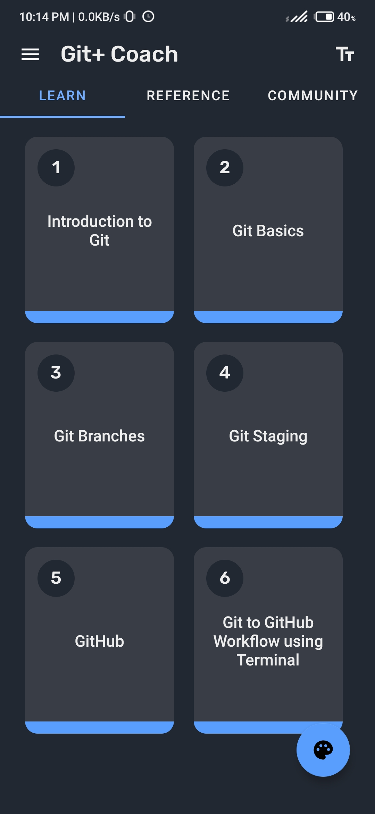
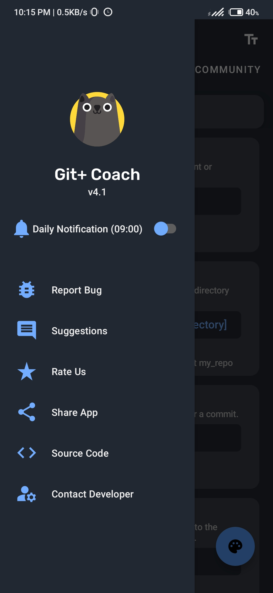
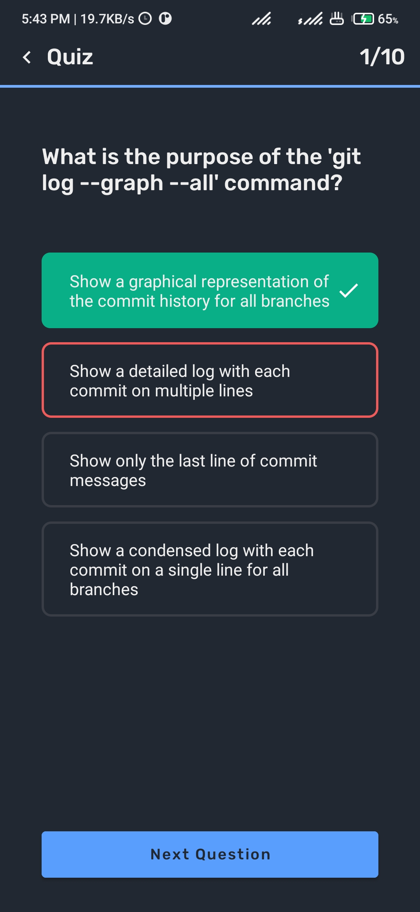
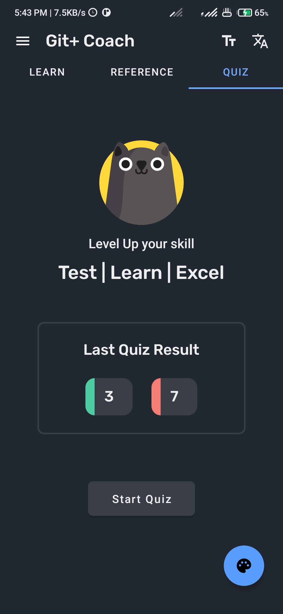
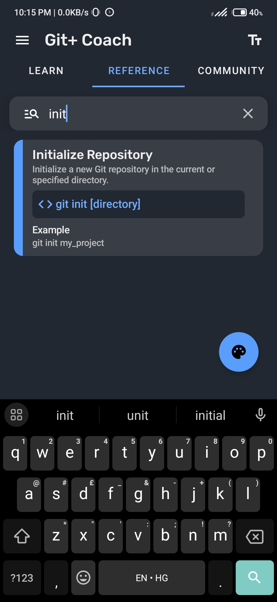
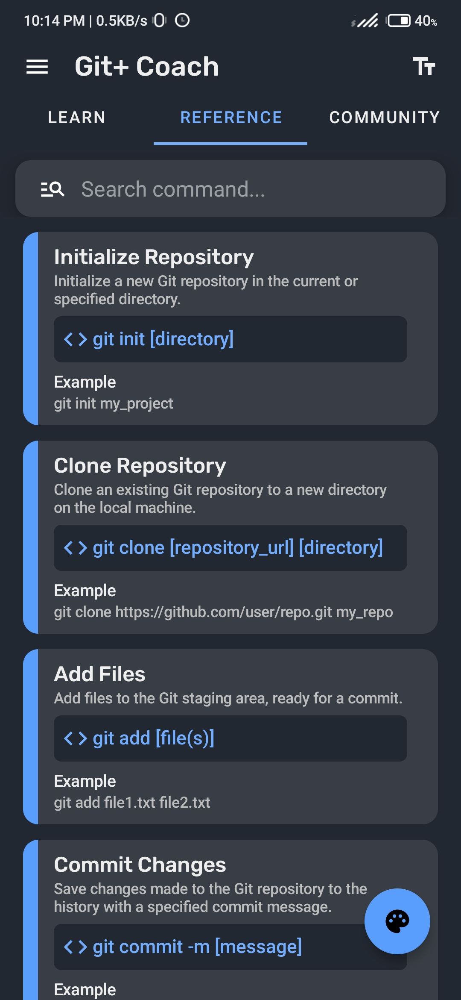
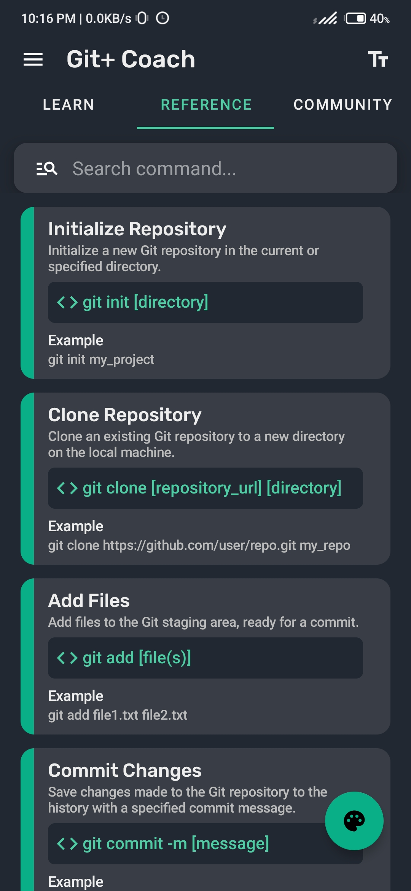
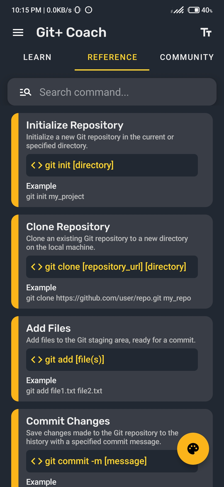

# **Git+ Coach**

Git+ Coach is a free education app designed to help users learn Git and its commands. With an easy-to-use interface and smooth animations, the app provides an enjoyable user experience without any ads to distract from the learning process.

 

[//]: # ()
[//]: # ()
[//]: # ()

 
 
 

[//]: # ()
[//]: # ()

## Features
- Browse through different categories of Git commands
- Test your Git knowledge with Quiz
- Search for any Git command
- Font Size Customization
- Copy Git command on single tap
- Clear explanations and examples of each command
- Smooth animations for a great user experience
- Cool Themes: Blue,Green, Red, and Yellow
- No ADS or In-App Subscription
- Support 8 Languages (English,Chinese,German,Italian,Portuguese,Russian,Spanish,Turkish)

## Screenshots

|  |  |  |  |
|--|---|---|---|
|  |  |  |  |
|  |  |

